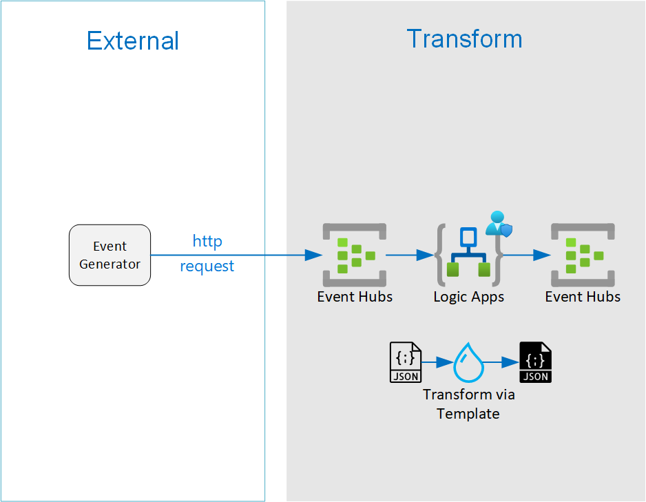

************
Convert Json
************

This is an example project on using Azure Logic apps to convert Json

This project demonstrates how to convert Json using several Azure technologies:

- Python Azure API
- Docker Images
- Azure Eventhubs
- Azure Logic Apps

|architecture-overview|

Workflow:

- Generator App sents message to Eventhubs
- LogicApp converts the message to a new format
- LogicApp publish new message to receiving Eventhubs
  
Setup
=====
This setup will deploy the core infrastructure needed to run the the solution:

- Core infrastructure

  - Resource Group
  - Eventhubs

Core infrastructure
-------------------

**Global Variables**

Configure the global variables

.. code-block:: bash

    # Global
    RG_NAME = jsonconvert
    RG_REGION = westus
    STORAGE_ACCOUNT_NAME = jsonconvert
    
    #Event Hubs
    EH_NAMESPACE = jsconvonvert_ehn
    EH_NAME = jsonconvert_eh

    # Logic App variables
    LOGIC_APP_NAME = JsonConvert

    # Transform - Function App    
    FUNCTION_APP_NAME = JsonConvertFunc

    # Transofrm - Container
    CONTAINER_INSTANCE_NAME = jsonconvert-ci

    # Existing Resources
    ACR_REGISTRY_NAME = <existing-registry-name>
    SERVICE_PRINCIPAL_ID = <existing-service-principal-id>
    SERVICE_PRINCIPAL_PASSWORD = <existing-service-principal-password>

**Resource Group**

Create a resource group for this project

.. code-block:: bash

    az group create --name $RG_NAME --location $RG_REGION

**Evenhubs**

.. code-block:: bash

    # Create an Event Hubs namespace. Specify a name for the Event Hubs namespace.
    az eventhubs namespace create --name $EH_NAMESPACE --resource-group $RG_NAME -l $RG_REGION   

    # Create an event hub. Specify a name for the event hub. 
    az eventhubs eventhub create --name $EH_NAME --resource-group $RG_NAME --namespace-name $EH_NAMESPACE

    # Create Read Policy and Connection string
    #TBD 

**Logic App**

- Create Logic App

Make a copy of ``logic_app\definition-example.json`` and rename to ``logic_app\definition.json``. Edit the file with the necessary values.

- The ``<subscription_id>`` is the target subscription id.

Deploy the Logic App 

.. code-block:: bash

    az logic workflow create --definition /path_to_project/logic_app/definition.json
    --location $RG_REGION
    --name $LOGIC_APP_NAME
    --resource-group $RG_NAME

Generator
---------

The generator is a python application that runs in a docker container. The container expects the following environment variables stored in a ``local.env`` file.

Make a copy of ``local-example.env`` and rename to ``local.env``. Edit the file with the necessary values.

- The ``EVENT_HUB_CONNECTION_STRING`` is in the format ``Endpoint=sb://<yournamespace>.servicebus.windows.net/;SharedAccessKeyName=<yoursharedaccesskeyname>;SharedAccessKey=<yoursharedaccesskey>``
- The ``EVENT_HUB_NAME`` is the name of your eventhub.
- The ``TEMPLATE_PATH`` is the path to your message template file ``/path/to/templates/``
- The ``TEMPLATE_SOURCE_MESSAGE`` is the name of the template to generate the source message. 

Run generator in docker

.. code-block:: bash

    # Build and run image
    > docker build --pull --rm -f "dockerfile" -t jsonconvert:latest "."
    > docker run --rm -it --env-file local.env jsonconvert:latest

    #Run app
    > python generator/python_generator/main.py --template_path /path/to/templates/

Transform
---------
This project shows three different ways to transform Json to Json documents from a Logic App:

- Liquid Transform Action
- Call Azure Function
- Call Container Instance

+------------------------------+--------------------------------------------+-------------------------------------------+--------------------+
| Feature                      | Liquid Transform Action                    | Azure Function                            | Container Instance |
+==============================+============================================+===========================================+====================+
| Use Liquid Template Language | ✅                                          | ✅                                         | ✅                  |
+------------------------------+--------------------------------------------+-------------------------------------------+--------------------+
| Use Jinja Template Language  | ❌                                          | ✅                                         | ✅                  |
+------------------------------+--------------------------------------------+-------------------------------------------+--------------------+
| Use Custom Filters           | ❌                                          | ✅                                         | ✅                  |
+------------------------------+--------------------------------------------+-------------------------------------------+--------------------+
| Append Additional Data       | ❌                                          | ✅                                         | ✅                  |
+------------------------------+--------------------------------------------+-------------------------------------------+--------------------+
| Integration Account Required | ✅                                          | ❌                                         | ❌                  |
+------------------------------+--------------------------------------------+-------------------------------------------+--------------------+
| Root Element from EventHubs  | ``{"content": "result"[...]}"``            | ``{"result"[...]}"``                      |                    |
+------------------------------+--------------------------------------------+-------------------------------------------+--------------------+
| Date Format                  | ``"CreatedTime": "4/14/2021 11:55:53 PM"`` | ``"CreatedTime": "2021-04-14T23:55:53Z"`` |                    |
+------------------------------+--------------------------------------------+-------------------------------------------+--------------------+

**Liquid Transform Action Option**

* Create an integration account
* Upload the file ``/docs/template_transform.liquid.json`` as a Map
* Add the step to the logic app

**Azure Function Option**

|architecture-function-overview|

* Publish the transform code as a function
* Add the step to the logic app

Run function locally with ``func``

Add the following to ``local.settings.json``:

- The ``TEMPLATE_PATH`` is the path to your message template file ``/path/to/templates/``
- The ``TEMPLATE_SOURCE_MESSAGE`` is the name of the template to generate the source message. 

.. code-block:: json

    {
        "Values": {
            "TEMPLATE_PATH":".",
            "TEMPLATE_NAME":"template_transform.liquid.json"
        }
    }

Start the runtime using ``func``.

.. code-block:: bash

    func start

Run function locally as Docker. The docker image mimics the folder structure on Azure.

.. code-block:: bash

    # Build and Run Docker
    > cd /project_root/transform/TransformJsonToJason
    > docker build --pull --rm -f "dockerfile" -t jsontransform:latest "."
    > docker run --rm -it -p 8080:80 --env-file local.env jsontransform:latest

    #Run app
    > /azure-functions-host/Microsoft.Azure.WebJobs.Script.WebHost

Create the function on Azure

.. code-block:: bash

    # Create Storage Account
    az storage account create 
        --resource-group $RG_NAME
        --name $STORAGE_ACCOUNT_NAME 
        --location $RG_REGION          
        --sku Standard_LRS

    az functionapp create 
        --resource-group $RG_NAME
        --consumption-plan-location $RG_REGION 
        --runtime python 
        --runtime-version 3.8 
        --functions-version 3 
        --name $FUNCTION_APP_NAME 
        --storage-account $STORAGE_ACCOUNT_NAME 
        --os-type linux

Deploy the function app.

.. code-block:: bash

    cd /path_to_project
    func azure functionapp publish $FUNCTION_APP_NAME 

Configure Environment Variables

.. code-block:: bash

    az functionapp config appsettings set 
        --name $FUNCTION_APP_NAME 
        --resource-group $RG_NAME 
        --settings TEMPLATE_PATH=.

**Container Instance Option**

* Create Container registry
* Create Container Instance Group
* Create Service Principal with Access
* Build ``transform_dockerfile`` 
* Publish image
* Add the step to the logic app

Build and run the image locally 

.. code-block:: bash

    # Build and Run Docker
    > cd /project_root/transform_docker
    > docker build --pull --rm -f "dockerfile" -t jsontransform_docker:latest "."
    > docker run --rm -it -p 8080:8080 --env-file local.env jsontransform_docker:latest

    #Run app
    > python server.py

Tag and push to Remote registry

.. code-block:: bash

    docker tag jsontransform_docker:latest $ACR_REGISTRY_NAME.azurecr.io/jsontransform:v1
    az acr login --name $ACR_REGISTRY_NAME
    docker push $ACR_REGISTRY_NAME.azurecr.io/jsontransform:v1

Start container

.. code-block:: bash

    az container create --resource-group $RG_NAME --name $CONTAINER_INSTANCE_NAME 
        --image $ACR_REGISTRY_NAME.azurecr.io/jsontransform:v1 
        --registry-username $SERVICE_PRINCIPAL_ID 
        --registry-password $SERVICE_PRINCIPAL_PASSWORD 
        --restart-policy Never
        --environment-variables 'TEMPLATE_PATH=/app/' 'TEMPLATE_NAME=template_transform.liquid.fx.json'
        --port 8080 --ip-address public --dns-name-label jsonconvert

Development
===========

Setup your dev environment by creating a virtual environment

.. code-block:: bash

    # virtualenv \path\to\.venv -p path\to\specific_version_python.exe
    python -m venv .venv.
    .venv\scripts\activate

    deactivate

Make a copy of local-example.env and rename to local.env. Edit the file with the necessary values.

 - The ``EVENT_HUB_CONNECTION_STRING`` is in the format ``Endpoint=sb://<yournamespace>.servicebus.windows.net/;SharedAccessKeyName=<yoursharedaccesskeyname>;SharedAccessKey=<yoursharedaccesskey>``
 - The ``EVENT_HUB_NAME`` is the name of your eventhub.
 - The ``TEMPLATE_PATH`` is the path to your message template file ``/path/to/templates/``

Style Guidelines
----------------

This project enforces quite strict `PEP8 <https://www.python.org/dev/peps/pep-0008/>`_ and `PEP257 (Docstring Conventions) <https://www.python.org/dev/peps/pep-0257/>`_ compliance on all code submitted.

We use `Black <https://github.com/psf/black>`_ for uncompromised code formatting.

Summary of the most relevant points:

- Comments should be full sentences and end with a period.
- `Imports <https://www.python.org/dev/peps/pep-0008/#imports>`_  should be ordered.
- Constants and the content of lists and dictionaries should be in alphabetical order.
- It is advisable to adjust IDE or editor settings to match those requirements.

Ordering of imports
-------------------

Instead of ordering the imports manually, use `isort <https://github.com/timothycrosley/isort>`_.

.. code-block:: bash

    pip3 install isort
    isort -rc .

Use new style string formatting
-------------------------------

Prefer `f-strings <https://docs.python.org/3/reference/lexical_analysis.html#f-strings>`_ over ``%`` or ``str.format``.

.. code-block:: python

    #New
    f"{some_value} {some_other_value}"
    # Old, wrong
    "{} {}".format("New", "style")
    "%s %s" % ("Old", "style")

One exception is for logging which uses the percentage formatting. This is to avoid formatting the log message when it is suppressed.

.. code-block:: python

    _LOGGER.info("Can't connect to the webservice %s at %s", string1, string2)

Testing
--------
You'll need to install the test dependencies into your Python environment:

.. code-block:: bash

    pip3 install -r requirements_dev.txt

Now that you have all test dependencies installed, you can run linting and tests on the project:

.. code-block:: bash

    isort .
    codespell  --skip="./.*,*.csv,*.json,*.pyc,./docs/_build/*,./htmlcov/*"
    black setup.py generator transform transform_docker tests
    flake8 setup.py generator transform transform_docker tests
    pylint setup.py generator transform transform_docker tests
    pydocstyle setup.py generator transform transform_docker tests
    pytest tests

References
----------
- Eventhubs python library https://docs.microsoft.com/en-us/python/api/overview/azure/eventhub-readme?view=azure-python
- Eventhubs python getting started https://docs.microsoft.com/en-us/azure/event-hubs/event-hubs-python-get-started-send
- Liquid template https://shopify.github.io/liquid/basics/introduction/
- Liquid in Logic App https://docs.microsoft.com/en-us/azure/logic-apps/logic-apps-enterprise-integration-liquid-transform
- Create Logic App Integration Account https://docs.microsoft.com/en-us/azure/logic-apps/logic-apps-enterprise-integration-create-integration-account?tabs=azure-portal
- Create an Azure Function https://docs.microsoft.com/en-us/azure/azure-functions/create-first-function-cli-python?tabs=azure-cli%2Cbash%2Cbrowser
- Azure Functions on Docker https://docs.microsoft.com/en-us/azure/azure-functions/functions-create-function-linux-custom-image?tabs=bash%2Cportal&pivots=programming-language-python
- Enterprise Logic App and Event Messaging https://docs.microsoft.com/en-us/azure/architecture/reference-architectures/enterprise-integration/queues-events